# 📚 Storygram

A Django-based storytelling platform where users collaboratively create, manage, and rate community-driven stories. Storygram empowers writers to contribute individual chapters, explore creative story branches, and engage with others through a shared narrative experience.

## 🎯 Project Purpose & Rationale

**Storygram** is designed for writers, readers, and storytelling enthusiasts who want to collaboratively build narratives in a flexible, branching format. It is ideal for users who enjoy sharing creative writing, exploring alternate story paths, and rating each other's contributions.

This application was built as part of the Level 5 Diploma in Web Application Development to demonstrate full-stack development skills using Django. The project aligns with real-world practices such as user authentication, CRUD operations, relational database modeling, and deployment to a cloud platform (Heroku).

Storygram solves the problem of fragmented creative collaboration by offering a centralised platform where users can:

- Create and contribute to shared stories, one chapter at a time.
- View and rate different versions of chapters created by other contributors.
- Organise stories into coherent branches while encouraging community participation.

The project demonstrates key backend development skills expected by assessors and employers, including:

- A responsive and accessible UX.
- Secure data management.
- Clean, PEP8-compliant Python code.
- Clear documentation and version control practices.

## 🧠 UX & UI Design

### 1. Strategy

#### 🎯 User Goals

The primary user goals for _Storygram_ are to:

- Empower users to write and share original stories chapter by chapter.
- Encourage collaboration by enabling other users to contribute to ongoing stories.
- Guide narrative direction through community-based chapter ranking.
- Provide control to story owners over visibility (public/private) and contribution permissions.
- Support intuitive navigation and access to engaging, top-rated stories.
- Offer profile management and secure session handling for all users.

**Business/Educational Goals:**

- Demonstrate full-stack web development skills.
- Apply UX principles for real-world, user-centred design.
- Showcase coding proficiency and project planning for assessment and potential employers.

### Scope

The project includes the following core features:

- User authentication (register, login, logout).
- Story creation with title, image, description, and collaboration settings.
- Chapter creation and rating system (1–5 stars).
- Visibility settings for stories (public/private).
- Editable/deletable content for authors.
- Filtering and sorting stories on the homepage.

Planned or future features:

- Comment system.
- Follow/favourite authors and stories.
- Notification system for new contributions and ratings.

### Structure

The platform follows a simple, intuitive structure:

- Homepage: Shows top-ranked stories with filtering and search tools.
- Story Detail Page: Displays the story summary and list of chapters.
- Chapter Page: Displays chapter content and rating functionality.
- Profile Page: Allows users to edit profile and view their stories/chapters.
- Admin Panel: For site administrators to manage users and content.

Each story can have multiple chapters submitted by different users, and the best-rated version is promoted as the official continuation.

### Skeleton

Wireframes were created using Balsamiq to plan the responsive layout for:

- Mobile
- Tablet
- Desktop

Each view includes:

- Navigation bar
- Homepage story grid layout
- Story detail and chapter forms
- Rating and contribution interactions

**WIREFRAMES**

These wireframes were designed in Balsamiq and illustrate the responsive layout planned for Storygram across mobile, tablet, and desktop devices.

**🏠 Home Page**

- Mobile:  
  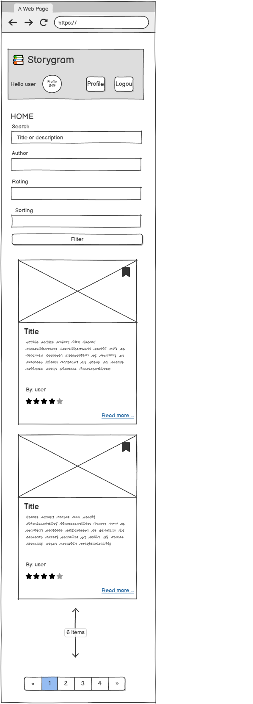
- Tablet:  
  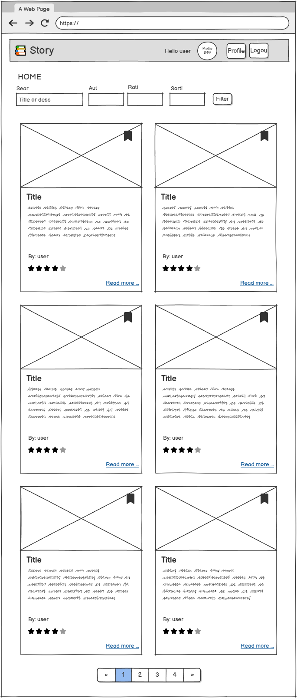
- Desktop:  
  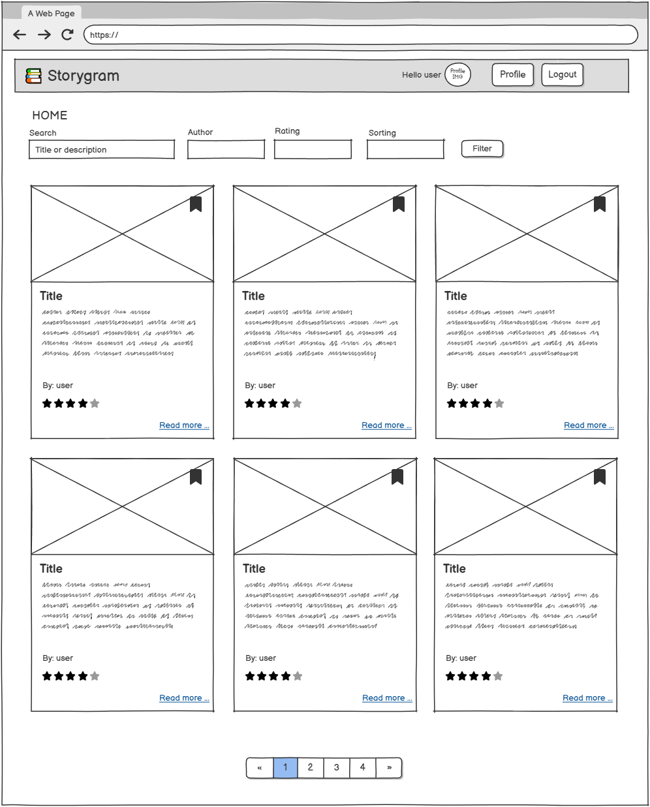

**👤 Profile Page**

- Tablet & Mobile:  
  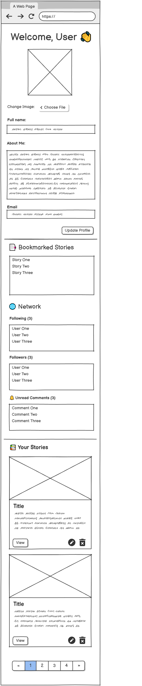
- Desktop:  
  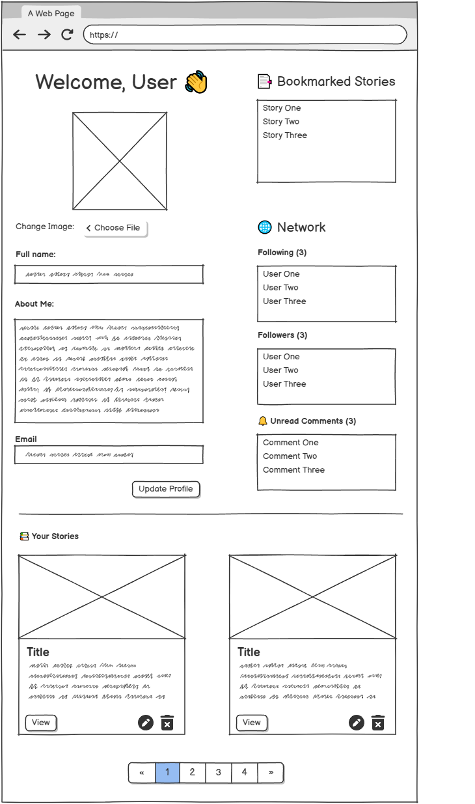

**📖 Story Page**

- Tablet & Mobile:  
  
- Desktop:  
  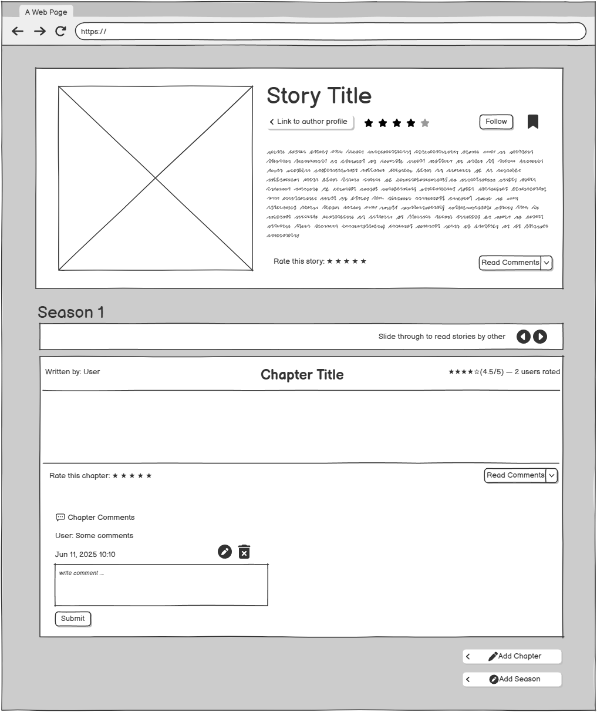

### Surface

**Design Choices:**

- **Framework:** Bootstrap 5.3 for consistent layout and responsive design.
- **Typography:** Sans-serif fonts (Bootstrap default) for readability.
- **Colour Scheme:** Dark navbar, white background, and primary action buttons in green/blue for clarity.
- **Icons:** Bootstrap Icons for bookmarks, ratings, and UI feedback.
- **Accessibility:** Used semantic HTML, colour contrast, alt text for images, and responsive layouts for mobile users.

**MOCKUPS**

These mockups reflect the final visual design and layout used in Storygram.

**🏠 Home Page**

- Mobile:  
  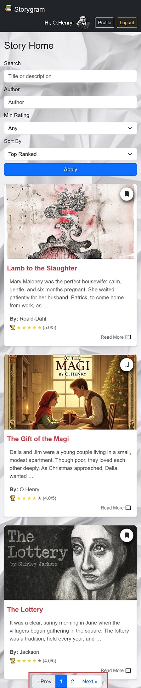
- Tablet:  
  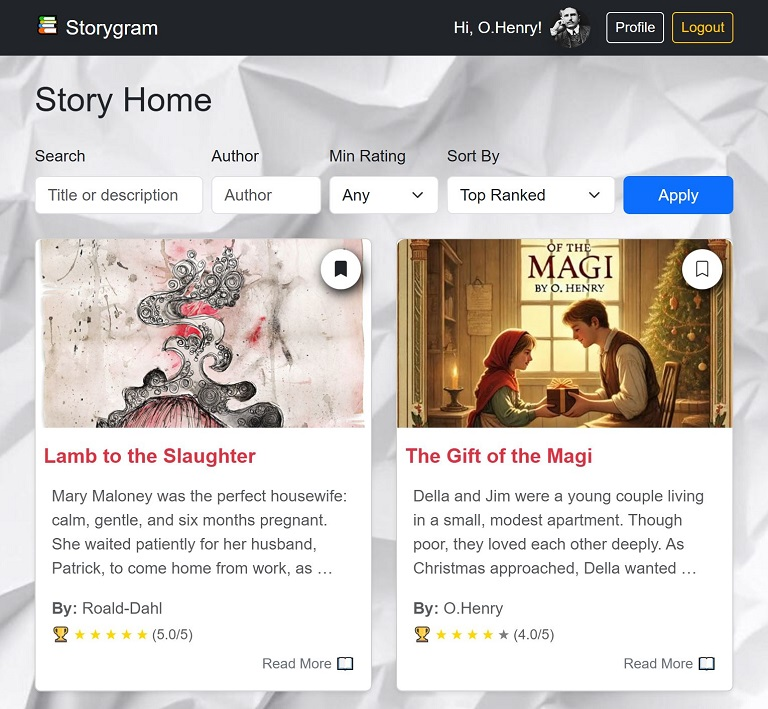
- Desktop:  
  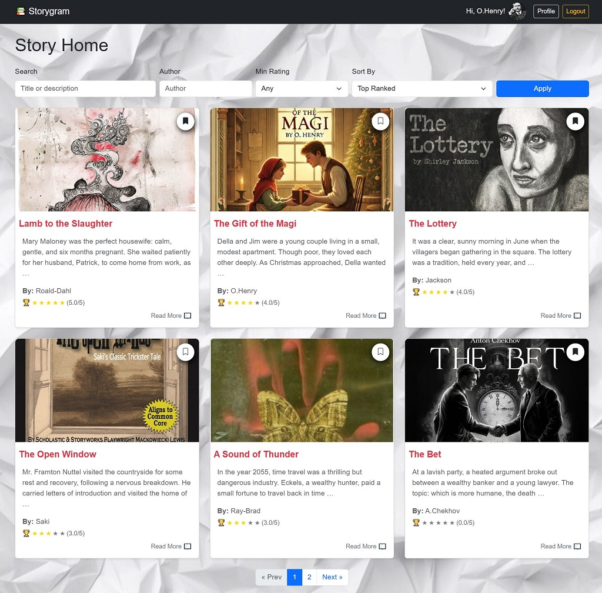

**👤 Profile Page**

- Tablet & Mobile:  
  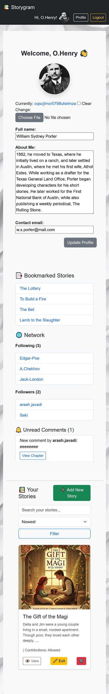
- Desktop:  
  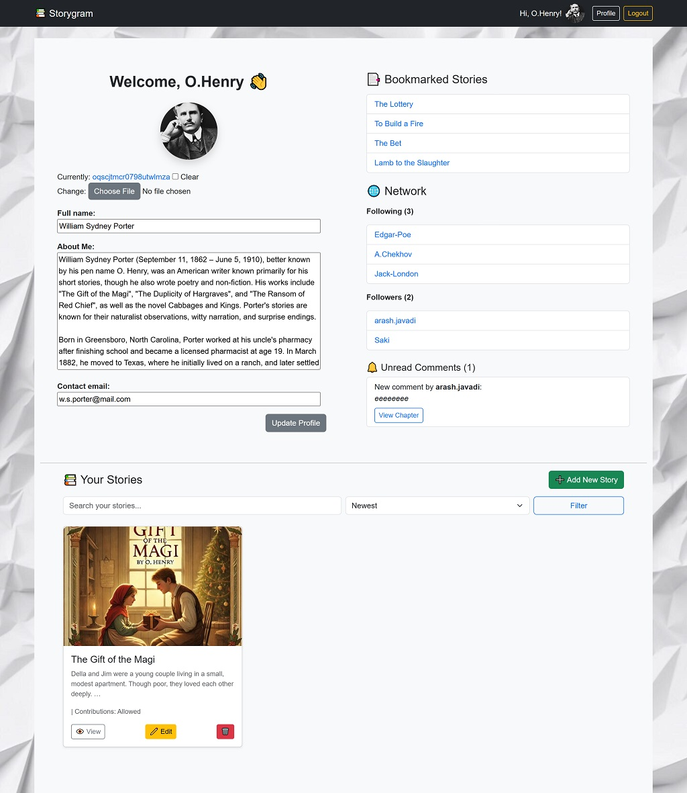

**📖 Story Page**

- Tablet & Mobile:  
  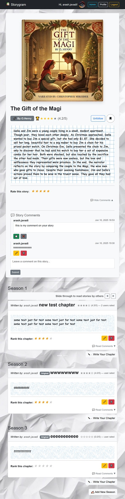
- Desktop:  
  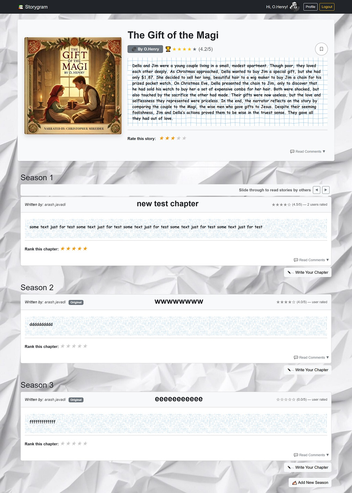

## 👥 Target Audience & User Stories

### 🎯 Target Audience

_Storygram_ is designed for:

- **Aspiring writers** who want to build creative stories and share them online.
- **Readers** who enjoy interactive fiction and want to explore branching narratives.
- **Collaborative storytellers** who prefer community-driven content creation.
- **Students or hobbyists** interested in writing, reading, or contributing to stories chapter-by-chapter.
- **Developers or assessors** evaluating the application’s full-stack functionality, UX design, and code structure.

---

### ✅ User Stories

User stories are grouped by priority using the MoSCoW method:

#### Must Have

- As a **visitor**, I want to **register and log in** so I can **write and interact with stories**.
- As a **registered user**, I want to **create a new story** so I can **share my writing**.
- As a **user**, I want to **write multiple chapters** so I can **continue the narrative over time**.
- As a **user**, I want to **rank each chapter** so I can **express how much I liked it**.
- As a **story owner**, I want to **set my story as public or private** so I can **control who sees it**.
- As a **visitor or user**, I want to **see a homepage with top-ranked stories** so I can **discover engaging content**.
- As a **user**, I want to **edit or delete my stories and chapters** so I can **maintain and update my content**.
- As a **user**, I want to **log out securely** to **protect my account and privacy**.
- As a **user**, I want to **view and read full stories and their chapters** so I can **enjoy complete narratives**.

#### Should Have

- As a **story creator**, I want to **allow or disallow contributions** so I can **retain creative control**.
- As a **logged-in user**, I want to **write a new chapter for someone else's story** so I can **collaborate on ongoing stories**.
- As a **contributor**, I want to **receive rankings for each chapter** so I can **gain feedback and recognition**.
- As the **system**, I want to **automatically choose the highest-ranked chapter** as the **official next chapter**.
- As a **user**, I want to **enable or disable contributions** before publishing my story so I can **decide on collaboration**.

#### Could Have

- As a **user**, I want to **comment on stories** so I can **give feedback or ask questions**.
- As a **user**, I want to **follow my favourite authors or stories** so I can **stay updated on new chapters**.
- As a **user**, I want to **get notified when someone contributes or ranks my story** so I can **track engagement**.
- As a **visitor**, I want to **search or filter stories by category, tag, or author** so I can **find stories that interest me**.

---

> You can find evidence for the successful implementation of these user stories in the [Testing](#-testing) section.
