# 📚 Storygram

A Django-based storytelling platform where users collaboratively create, manage, and rate community-driven stories. Storygram empowers writers to contribute individual chapters, explore creative story branches, and engage with others through a shared narrative experience.

## 🎯 Project Purpose & Rationale

**Storygram** is designed for writers, readers, and storytelling enthusiasts who want to collaboratively build narratives in a flexible, branching format. It is ideal for users who enjoy sharing creative writing, exploring alternate story paths, and rating each other's contributions.

This application was built as part of the Level 5 Diploma in Web Application Development to demonstrate full-stack development skills using Django. The project aligns with real-world practices such as user authentication, CRUD operations, relational database modeling, and deployment to a cloud platform (Heroku).

Storygram solves the problem of fragmented creative collaboration by offering a centralised platform where users can:

- Create and contribute to shared stories, one chapter at a time.
- View and rate different versions of chapters created by other contributors.
- Organise stories into coherent branches while encouraging community participation.

The project demonstrates key backend development skills expected by assessors and employers, including:

- A responsive and accessible UX.
- Secure data management.
- Clean, PEP8-compliant Python code.
- Clear documentation and version control practices.

## 🧠 UX & UI Design

### 1. Strategy

#### 🎯 User Goals

The primary user goals for _Storygram_ are to:

- Empower users to write and share original stories chapter by chapter.
- Encourage collaboration by enabling other users to contribute to ongoing stories.
- Guide narrative direction through community-based chapter ranking.
- Provide control to story owners over visibility (public/private) and contribution permissions.
- Support intuitive navigation and access to engaging, top-rated stories.
- Offer profile management and secure session handling for all users.

**Business/Educational Goals:**

- Demonstrate full-stack web development skills.
- Apply UX principles for real-world, user-centred design.
- Showcase coding proficiency and project planning for assessment and potential employers.

### Scope

The project includes the following core features:

- User authentication (register, login, logout).
- Story creation with title, image, description, and collaboration settings.
- Chapter creation and rating system (1–5 stars).
- Visibility settings for stories (public/private).
- Editable/deletable content for authors.
- Filtering and sorting stories on the homepage.

Planned or future features:

- Comment system.
- Follow/favourite authors and stories.
- Notification system for new contributions and ratings.

### Structure

The platform follows a simple, intuitive structure:

- Homepage: Shows top-ranked stories with filtering and search tools.
- Story Detail Page: Displays the story summary and list of chapters.
- Chapter Page: Displays chapter content and rating functionality.
- Profile Page: Allows users to edit profile and view their stories/chapters.
- Admin Panel: For site administrators to manage users and content.

Each story can have multiple chapters submitted by different users, and the best-rated version is promoted as the official continuation.

### Skeleton

Wireframes were created using Balsamiq to plan the responsive layout for:

- Mobile
- Tablet
- Desktop

Each view includes:

- Navigation bar
- Homepage story grid layout
- Story detail and chapter forms
- Rating and contribution interactions

## 🧰 Wireframes & Mockups

### **WIREFRAMES**

These wireframes were designed in Balsamiq and illustrate the responsive layout planned for Storygram across mobile, tablet, and desktop devices.

**🏠 Home Page**

- Mobile:  
  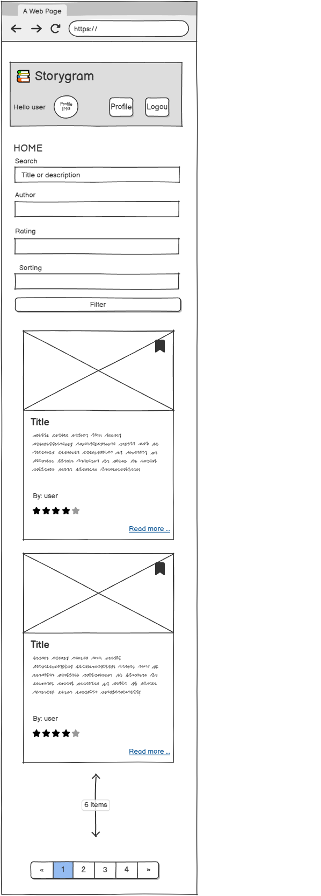
- Tablet:  
  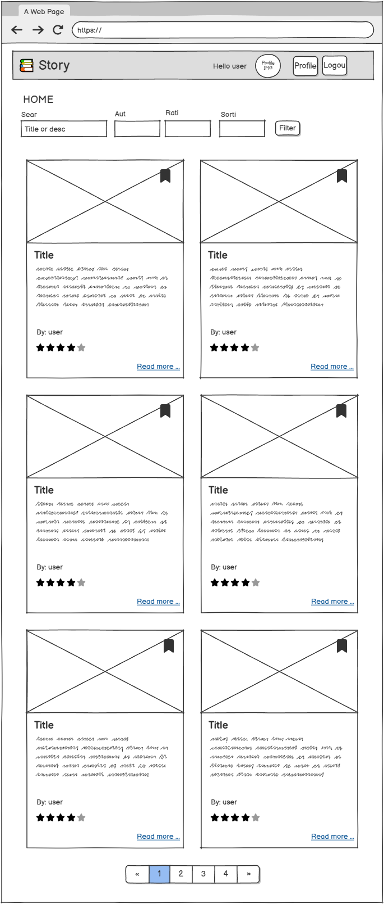
- Desktop:  
  

**👤 Profile Page**

- Tablet & Mobile:  
  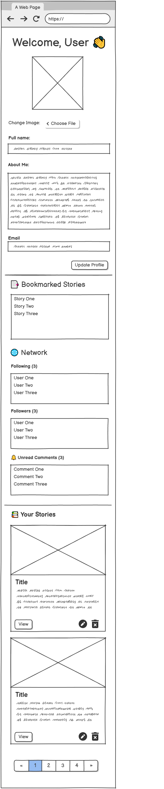
- Desktop:  
  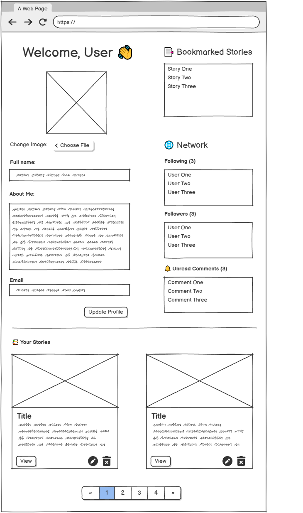

**📖 Story Page**

- Tablet & Mobile:  
  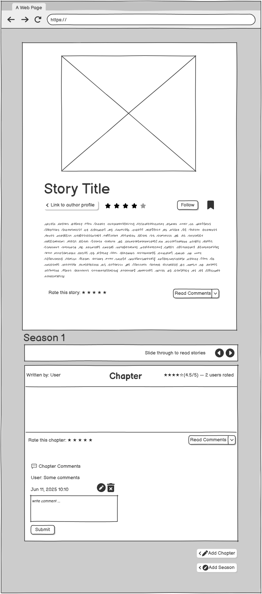
- Desktop:  
  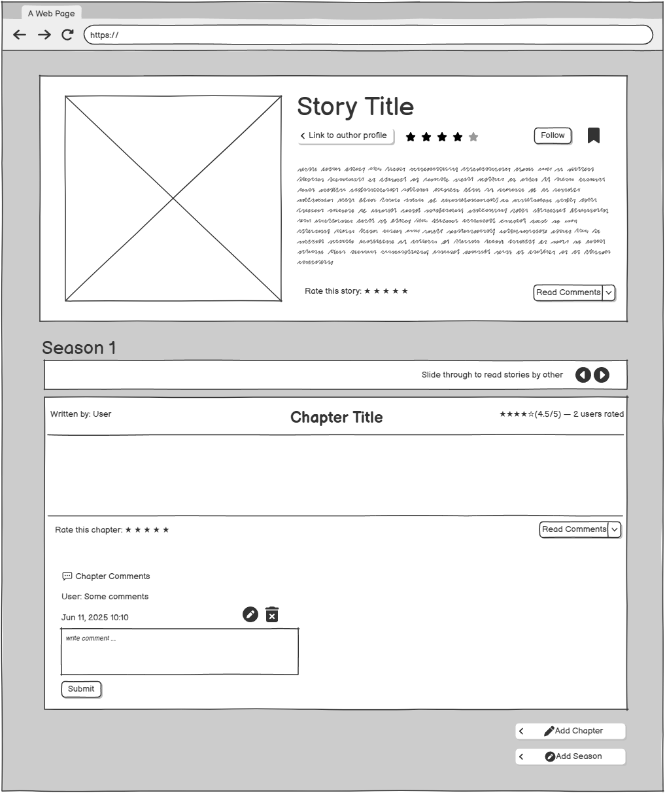

---

### Surface

**Design Choices:**

- **Framework:** Bootstrap 5.3 for consistent layout and responsive design.
- **Typography:** Sans-serif fonts (Bootstrap default) for readability.
- **Colour Scheme:** Dark navbar, white background, and primary action buttons in green/blue for clarity.
- **Icons:** Bootstrap Icons for bookmarks, ratings, and UI feedback.
- **Accessibility:** Used semantic HTML, colour contrast, alt text for images, and responsive layouts for mobile users.

---

### **MOCKUPS**

These mockups reflect the final visual design and layout used in Storygram.

**🏠 Home Page**

- Mobile:  
  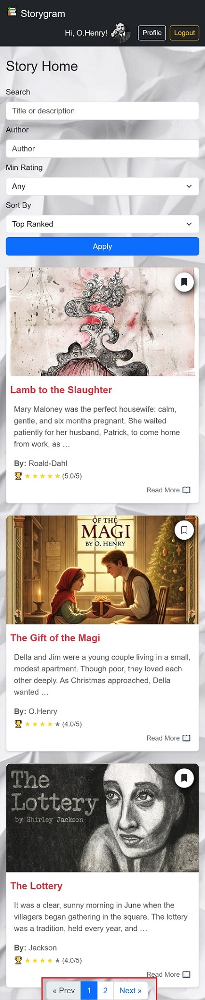
- Tablet:  
  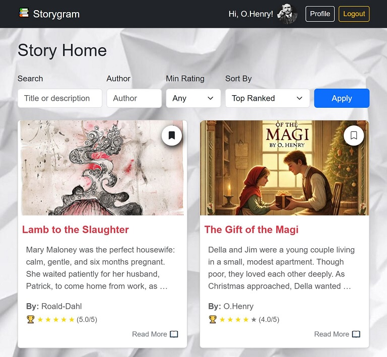
- Desktop:  
  

**👤 Profile Page**

- Tablet & Mobile:  
  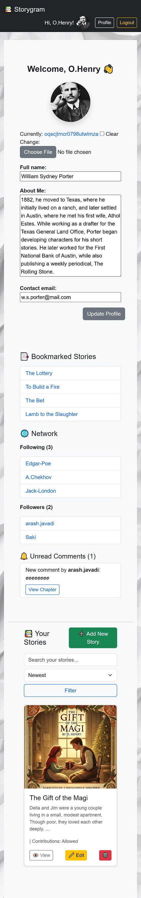
- Desktop:  
  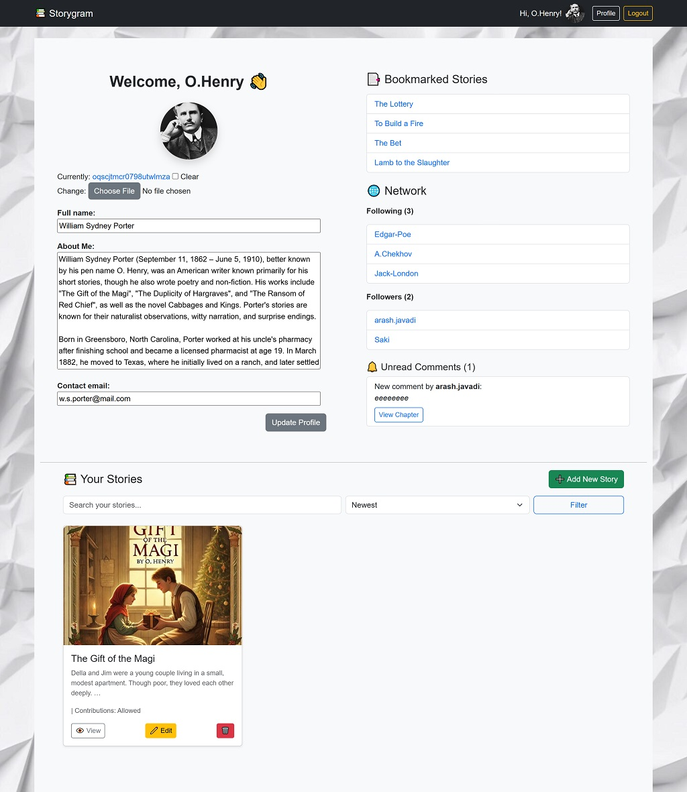

**📖 Story Page**

- Tablet & Mobile:  
  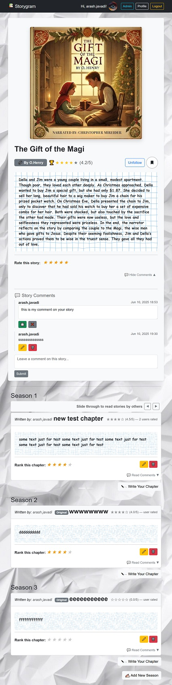
- Desktop:  
  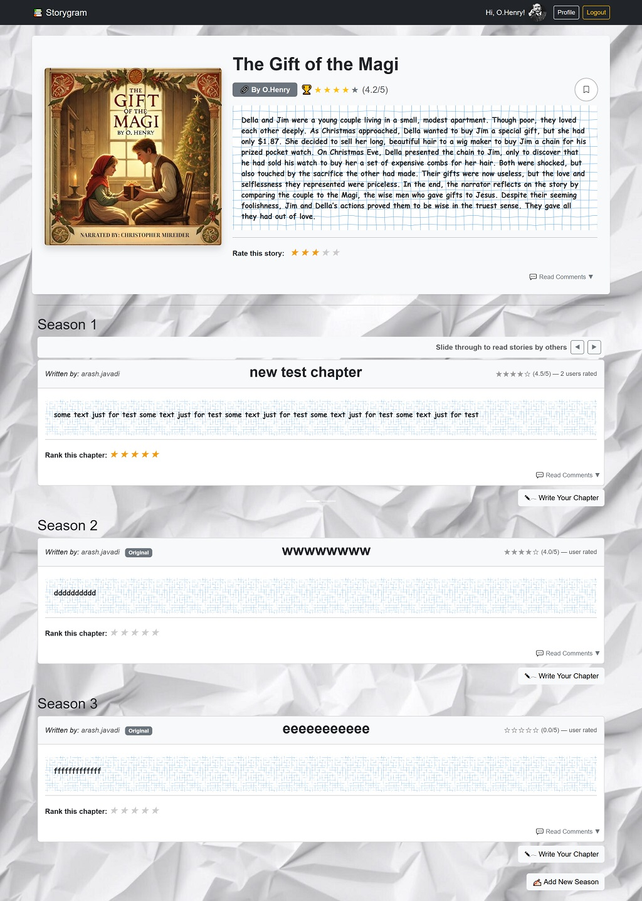

## 👥 Target Audience & User Stories

### 🎯 Target Audience

_Storygram_ is designed for:

- **Aspiring writers** who want to build creative stories and share them online.
- **Readers** who enjoy interactive fiction and want to explore branching narratives.
- **Collaborative storytellers** who prefer community-driven content creation.
- **Students or hobbyists** interested in writing, reading, or contributing to stories chapter-by-chapter.
- **Developers or assessors** evaluating the application’s full-stack functionality, UX design, and code structure.

---

### ✅ User Stories

User stories are grouped by priority using the MoSCoW method:

#### Must Have

- As a **visitor**, I want to **register and log in** so I can **write and interact with stories**.
- As a **registered user**, I want to **create a new story** so I can **share my writing**.
- As a **user**, I want to **write multiple chapters** so I can **continue the narrative over time**.
- As a **user**, I want to **rank each chapter** so I can **express how much I liked it**.
- As a **story owner**, I want to **set my story as public or private** so I can **control who sees it**.
- As a **visitor or user**, I want to **see a homepage with top-ranked stories** so I can **discover engaging content**.
- As a **user**, I want to **edit or delete my stories and chapters** so I can **maintain and update my content**.
- As a **user**, I want to **log out securely** to **protect my account and privacy**.
- As a **user**, I want to **view and read full stories and their chapters** so I can **enjoy complete narratives**.

#### Should Have

- As a **story creator**, I want to **allow or disallow contributions** so I can **retain creative control**.
- As a **logged-in user**, I want to **write a new chapter for someone else's story** so I can **collaborate on ongoing stories**.
- As a **contributor**, I want to **receive rankings for each chapter** so I can **gain feedback and recognition**.
- As the **system**, I want to **automatically choose the highest-ranked chapter** as the **official next chapter**.
- As a **user**, I want to **enable or disable contributions** before publishing my story so I can **decide on collaboration**.

#### Could Have

- As a **user**, I want to **comment on stories** so I can **give feedback or ask questions**.
- As a **user**, I want to **follow my favourite authors or stories** so I can **stay updated on new chapters**.
- As a **user**, I want to **get notified when someone contributes or ranks my story** so I can **track engagement**.
- As a **visitor**, I want to **search or filter stories by category, tag, or author** so I can **find stories that interest me**.

---

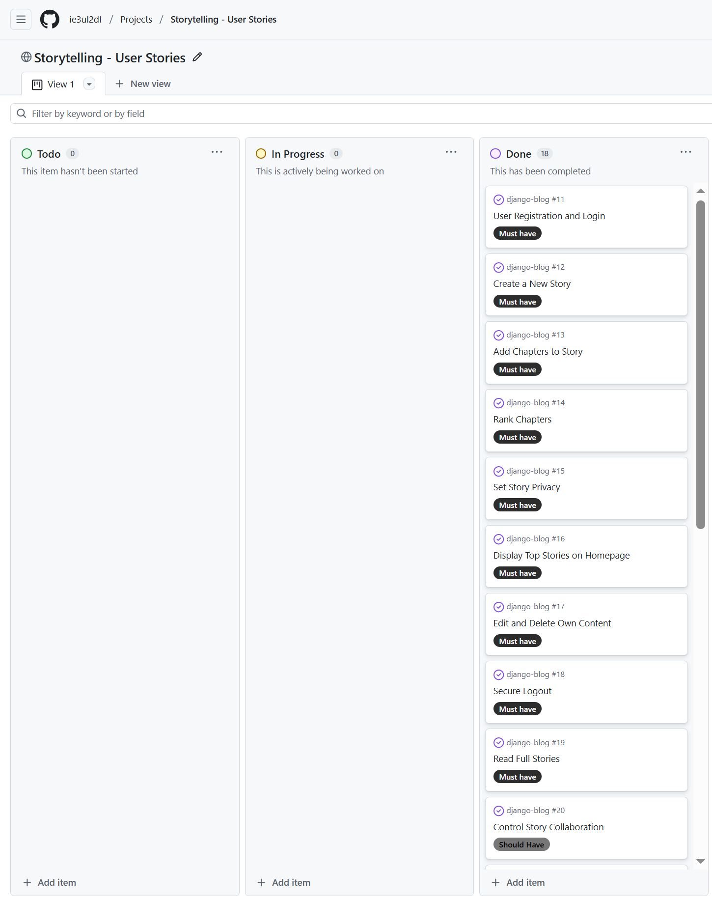

> You can find evidence for the successful implementation of these user stories in the [Testing](#-testing) section.

## 🧪 Testing

### ✅ Manual Testing of User Stories

The following table documents manual testing of each user story to ensure expected functionality. All features were tested successfully and worked as intended.

| User Story                         | Action Taken                                 | Expected Result                                  | Actual Result | Status |
| ---------------------------------- | -------------------------------------------- | ------------------------------------------------ | ------------- | ------ |
| Register/Login                     | Clicked "Register" and completed form        | User is redirected to profile/dashboard          | Success       | ✅     |
| Create Story                       | Filled out story form and submitted          | Story appears in list and on profile             | Success       | ✅     |
| Write Multiple Chapters            | Added multiple chapters to a story           | Chapters are saved and visible under story       | Success       | ✅     |
| Rank Chapter                       | Rated a chapter using form                   | Rating is saved and shown in average             | Success       | ✅     |
| Control Privacy                    | Set story to private in edit form            | Story becomes invisible to other users           | Success       | ✅     |
| View Homepage                      | Visited home page                            | Top-ranked stories are listed                    | Success       | ✅     |
| Edit/Delete Story                  | Edited and deleted a story from profile      | Changes reflect and story removed when deleted   | Success       | ✅     |
| View Full Story                    | Opened story detail page                     | Full story and chapters are readable             | Success       | ✅     |
| Enable/Disable Contributions       | Edited story to allow/disallow contributions | Contribution buttons appear/disappear            | Success       | ✅     |
| Contribute to Story                | Added a chapter to someone else's story      | Chapter saved under correct story                | Success       | ✅     |
| Auto-Select Highest Ranked Chapter | Rated chapters                               | Highest-rated chapter is marked as official next | Success       | ✅     |
| Logout                             | Clicked "Logout"                             | User is logged out and redirected                | Success       | ✅     |

---

### 🐞 Known Issues & Fixes

#### 📌 Dynamic Chapter Carousel Bug

**Issue:**  
All versions of a chapter were stacked vertically rather than sliding in a carousel.

**Causes:**

- Multiple or missing `.active` classes confused Bootstrap’s carousel.
- Parent chapter was duplicated inside and outside the loop.
- Django template logic used unsupported parentheses.

**Solutions:**

- Combined parent and children into one `.carousel-inner`.
- Applied `.active` to only one slide based on highest rating or position.
- Used `forloop.counter` to label chapters correctly.
- Hid carousel controls if only one slide exists.
- Rewrote logic using Django-compatible syntax without parentheses.

---

#### 📌 AJAX Star Rating Sync Error

**Issues:**

- Stars initially highlighted from right-to-left.
- Ratings were stored but not immediately reflected.
- Highest-rated chapter was not loaded first.
- JS errors occurred when trying to update non-existent DOM elements.

**Fixes:**

- Rewrote JS for proper hover behaviour and rating submission.
- Ensured DOM updates target `.avg` and `.count` reliably.
- Updated `views.py` to sort chapters by `avg_rating`.
- Carousel now loads top-rated chapter first and syncs indicators with content.

**Result:**  
Users can now rate chapters with immediate feedback, and carousels reflect dynamic rankings correctly.

---

### ⚙️ Other Development Challenges & Solutions

| Challenge                  | Fix                                                                                   |
| -------------------------- | ------------------------------------------------------------------------------------- |
| ⭐ Total ranking logic     | Calculated average of top-rated chapters per season; passed via context to templates. |
| 🔒 Button visibility       | Controlled via precise user-role checks in templates.                                 |
| 🧩 Template nesting issues | Simplified deeply nested logic with clearer tags and block structures.                |
| ❌ Delete confirmation     | Added dialog to prevent accidental deletions.                                         |
| 🧍 Author-only controls    | Applied `user == chapter.author` checks to show edit/delete only to authors.          |
| 🖼️ Image handling          | Configured `MEDIA_URL`, `MEDIA_ROOT`, and `` to avoid errors.     |
| 🧠 Contribution branching  | Allowed conditional creation of new chapters and seasons with correct permissions.    |
| 🧵 Carousel indicator sync | Ensured indicators match slide count to prevent JS errors.                            |

---

### ✅ HTML/CSS/JS/Python Validation

All code files were validated using the appropriate online tools. Minor warnings were fixed during the process and all files now pass validation successfully.

#### 🧾 Validators Used:

- **HTML** — [W3C HTML Validator](https://validator.w3.org/)
- **CSS** — [W3C CSS Validator](https://jigsaw.w3.org/css-validator/)
- **JavaScript** — [JSHint](https://jshint.com/)
- **Python** — [PEP8 Online](http://pep8online.com/) and `flake8`

#### 💻 Code Validation & Linting (Python)

**🧾 Code Formatting & Linting Log – `stories` App**

| Task                  | Tool        | Result                        |
| --------------------- | ----------- | ----------------------------- |
| Format code           | `black`     | ✅ 14 files auto-formatted    |
| Remove unused imports | `autoflake` | ✅ All unused imports removed |
| Style check           | `flake8`    | ✅ Passed with no issues      |

**Command History:**

```bash
black stories/
autoflake --remove-all-unused-imports --in-place --recursive stories/
flake8 stories
```

#### ✅ Python Code - PEP8 Compliance

All Python files were checked using `flake8` and are now free of PEP8 warnings and errors.

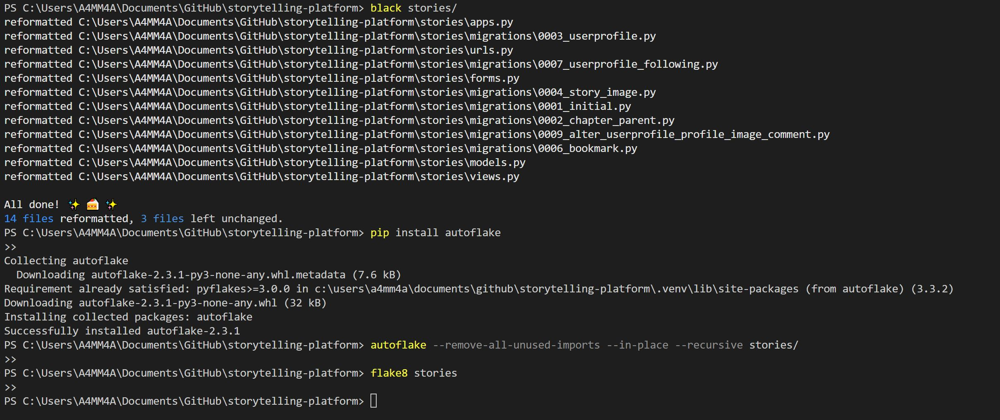

---

#### ✅ JavaScript Files - JSHint Results

Each JavaScript file was validated using JSHint with no major issues found.

- **bookmarks.js**

  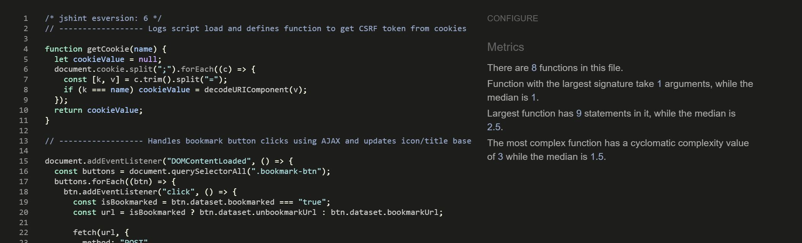

- **comment.js**

  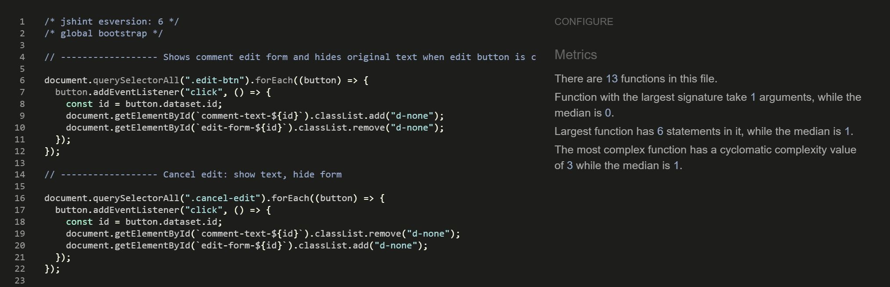

- **rating.js**

  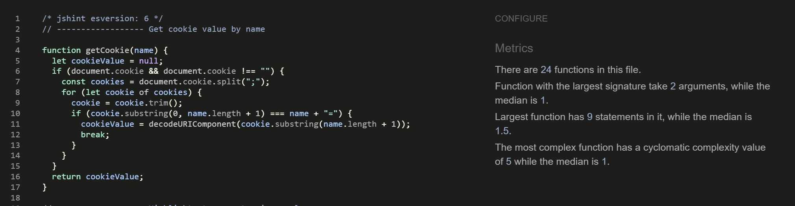

---

#### ✅ CSS File - W3C CSS Validator

The main stylesheet was validated and passed with no critical issues.

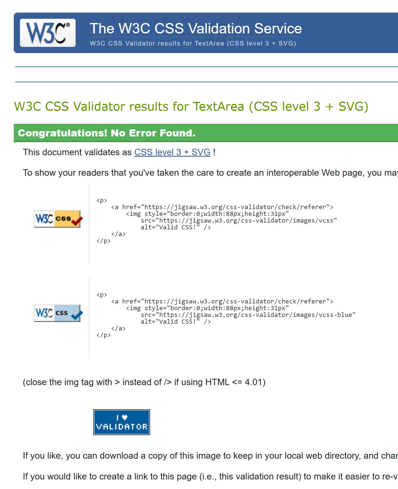

---

#### ✅ HTML Files - W3C HTML Validator

Several key pages were validated with W3C HTML Validator and passed successfully.

- **Home Page**

  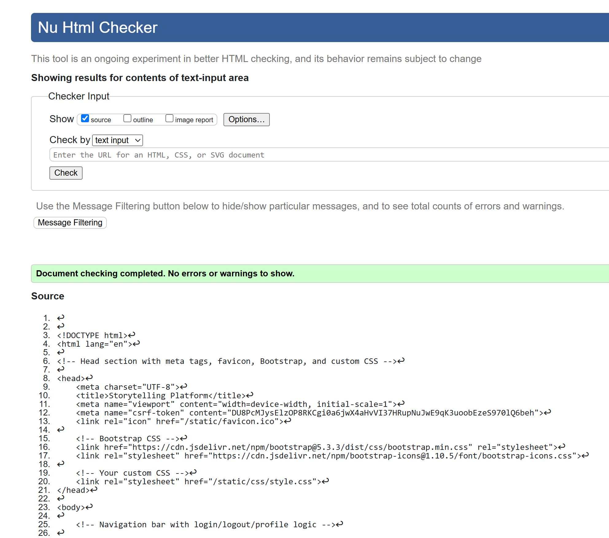

- **Story Detail Page**

  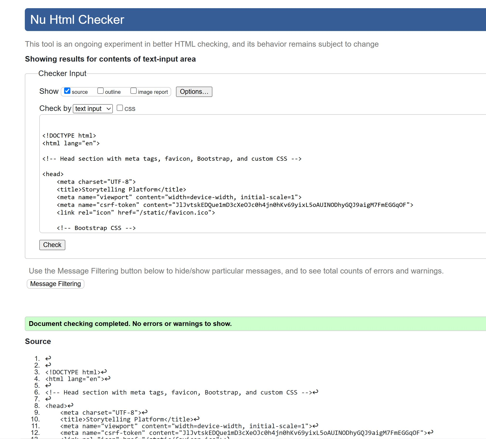

- **User Profile Page**

  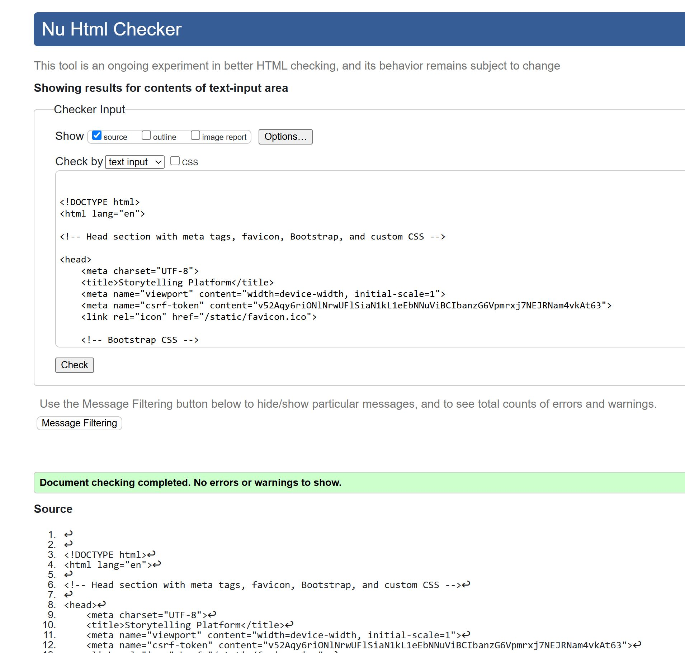

---

#### ✅ Lighthouse Report - Performance & Accessibility Audit

Lighthouse audits were conducted using **Google Chrome DevTools** on the deployed Heroku app.

- **Accessibility**: 99 — Excellent result, indicating strong colour contrast, focus order, and ARIA attributes.
- **SEO**: 91 — Good optimisation, with structured content, title/meta tags, and accessible links.

#### ⚠️ Performance & Best Practices - Testing Issues

Lighthouse could not generate valid metrics due to a Heroku-specific trace error (`NO_NAVSTART`), leading to failed recording of the following:

- First Contentful Paint
- Largest Contentful Paint
- Total Blocking Time
- Speed Index
- Cumulative Layout Shift

These issues are not caused by project code but are likely related to Heroku's free-tier dyno startup delays.

#### ⚠️ Trust & Safety Warnings

- **Insecure Requests**: 7 assets were loaded over HTTP instead of HTTPS.
- **Missing Security Headers**: No Content Security Policy (CSP) or HSTS.
- **Third-party Cookies**: Detected from CDNs and embedded resources.

#### 🔄 Planned Improvements

- Enforce HTTPS for all resources.
- Add CSP and HSTS headers using Django middleware.
- Migrate to a more consistent production hosting platform if needed.
- Optimise assets and reduce third-party script reliance.

> 🚀 Accessibility and SEO are in great condition. Performance testing will be reattempted in a stable deployment environment.

---

#### 📱 Responsiveness

The application was tested for responsiveness using:

- **Chrome DevTools** on:
  - Mobile view (iPhone SE, Pixel 5)
  - Tablet view (iPad, Galaxy Tab)
  - Desktop view (Full HD and smaller screen widths)

The layout adapted smoothly across all tested breakpoints. Grid-based layouts and Bootstrap’s responsive classes (`col-`, `container`, `row`, `d-flex`) ensured consistent alignment and spacing. Key UI elements like the navigation bar, forms, story cards, and chapter content displayed correctly on all devices.

✅ The site is fully responsive across all tested screen sizes.

---

#### 🌐 Cross-Browser Compatibility

The application was manually tested on the following browsers:

- Google Chrome (latest)
- Mozilla Firefox (latest)
- Microsoft Edge (latest)

All key features—user registration, login/logout, story and chapter CRUD operations, form submissions, ranking system, and interactive content—functioned correctly with no layout shifts or JavaScript issues.

✅ Full cross-browser compatibility confirmed.

---

## 🏗️ Information Architecture & Data Models

The **Storygram** application uses a relational database structure that reflects key real-world interactions between users, stories, chapters, and feedback. Below is an overview of each model and how they relate to each other, along with the entity-relationship diagram (ERD).

---

### 🗺️ Entity-Relationship Diagram

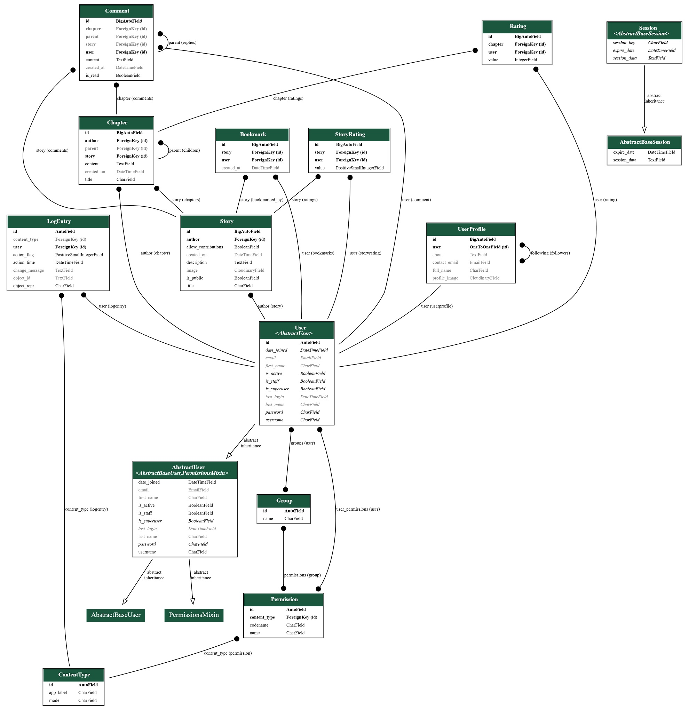

---

### 🧱 Models Overview

#### 📖 Story

- Represents a full story project.
- Connected to the `User` (author) with a **OneToMany** relationship via `ForeignKey`.
- Tracks whether it's **public** or **collaborative**, and stores a **Cloudinary image**.
- Related to:
  - `Chapter` (OneToMany)
  - `StoryRating` (OneToMany)
  - `Comment` (OneToMany)
  - `Bookmark` (OneToMany)

---

#### 📚 Chapter

- Represents a single part of a story.
- Related to a `Story` (**ForeignKey**), and an `author` (`User`).
- Supports **parent-child** self-relationships for branching/forking storylines (`parent = ForeignKey('self')`).
- Connected to:
  - `Rating` (OneToMany)
  - `Comment` (OneToMany)

---

#### ⭐ Rating

- Stores a numeric rating (1–5) for a chapter.
- Related to `Chapter` and `User`.
- **Constraint**: Each user can only rate a chapter once (`unique_together = ('chapter', 'user')`).

---

#### 🧑‍💻 UserProfile

- Extends Django’s built-in `User` with:
  - Bio, image, contact email
  - **Follow system** using `ManyToManyField` to self (asymmetric)
- Automatically created/updated via `post_save` signal.

---

#### 🌟 StoryRating

- Stores one overall rating per user **per story**.
- Related to `Story` and `User`.
- **Constraint**: Only one rating allowed per (user, story) pair (`unique_together = ('story', 'user')`).

---

#### 🔖 Bookmark

- Allows users to save/favourite stories.
- Related to `User` and `Story`.
- **Constraint**: No duplicate bookmarks (`unique_together = ('user', 'story')`).

---

#### 💬 Comment

- Users can comment on a `Story` or a `Chapter`.
- Supports threaded replies via self-referencing `parent = ForeignKey('self')`.
- Tracks `is_read` for notification logic.
- **Ordering**: Comments are chronologically sorted by `created_at`.

---

### 🔗 Summary of Relationships

| Model       | Related To            | Relationship Type              |
| ----------- | --------------------- | ------------------------------ |
| Story       | User                  | ForeignKey (ManyToOne)         |
| Story       | Chapter               | Reverse ForeignKey (OneToMany) |
| Chapter     | Story, User           | ForeignKey                     |
| Chapter     | Chapter (self)        | ForeignKey (Parent/Child)      |
| Chapter     | Rating                | Reverse ForeignKey             |
| Story       | StoryRating, Bookmark | Reverse ForeignKey             |
| UserProfile | User                  | OneToOne                       |
| UserProfile | UserProfile (self)    | ManyToMany (Following)         |
| Comment     | Story, Chapter, User  | ForeignKey                     |

---

The database schema is designed for flexibility in storytelling: allowing branching chapters, public/private visibility, rating systems, collaborative input, and rich user interactions through following, bookmarking, and commenting.

---

## 🔧 Application Features

### ✅ Implemented Features

Each of the following features corresponds to key user stories and supports core interactions on the Storygram platform:

#### 📖 Story Management

- Users can create, edit, and delete their own stories.
- Each story includes a title, description, image, public/private toggle, and collaboration option.
- Stories display author info, creation date, and story rating.

#### 🧩 Chapter Creation & Branching

- Authors and contributors can add chapters to stories.
- Support for **branching storylines** via parent-child relationships (forked narratives).
- Chapters are automatically sorted and threaded to represent the story flow.

#### 🌟 Rating System

- Logged-in users can rate both **chapters** and **entire stories** (1 to 5 stars).
- Each user can rate a story/chapter only once (enforced via unique constraints).
- Ratings are averaged and displayed per item (used in ranking logic on homepage).

#### 👤 User Profiles

- Every user has a profile page with:
  - Profile image (Cloudinary)
  - Full name, bio (“About Me”), contact email
  - Followers and following counters
- Follow system: Users can follow/unfollow others. Following is one-way (asymmetric).
- Profiles show all authored stories and contributions.

#### 🔔 Notification System

- Users receive **on-profile notifications** for:
  - New comments on their stories/chapters
  - Replies to their comments
  - New followers
- Future versions may support push or email alerts.

#### 💬 Comments & Replies

- Users can comment on both stories and individual chapters.
- Supports threaded replies using self-referencing relationships.
- Unread comments are tracked via `is_read` for future notifications.

#### 🔖 Bookmarks

- Users can bookmark stories for quick access.
- One bookmark per user per story (duplicates prevented via constraints).
- Bookmarked stories are listed in the user’s profile.

#### 🔍 Advanced Search

- Users can search for stories by:
  - Title
  - Author name
  - Keywords
  - Rating
- Search input is available on the homepage and filters live results.

#### 📱 Responsive UI

- The platform is fully responsive across mobile, tablet, and desktop breakpoints.
- Designed using Bootstrap 5 grid system and responsive classes.

#### 🧭 Smart Navigation & Admin Panel Access

- A consistent top navigation bar is present across all pages.
- If the logged-in user is an admin/superuser, an **Admin Panel** button is visible in the navbar linking to Django admin.

#### 📑 Pagination

- Homepage story list supports pagination to enhance loading speed and user experience.
- Dynamically loads stories page-by-page using Django’s pagination tools.

#### 🔐 Authentication & Authorization

- Django Allauth provides secure login, logout, and registration.
- Authenticated users can manage their own content.
- Only logged-in users can post comments, rate, and bookmark.

#### 🏠 Dynamic Homepage

- Homepage displays top stories based on total rank (combined rating of chapters and story).
- Features carousel-style previews and highest-rated content from each storyline branch.

---

### 🧪 Additional Features

- Validation with W3C (HTML/CSS), JSHint, and PEP8.
- Cross-browser support: tested on Chrome, Firefox, and Edge.
- Lighthouse tested: Accessibility and SEO scores above 90.

---

### 🚀 Future Features

These are planned for future releases to enhance interactivity and engagement:

- 📲 **Push & Email Alerts**: Extend notifications beyond profile view.
- 🏷️ **Tagging & Categories**: Organise stories by genre or theme.
- 💡 **Story Drafts**: Save stories/chapters without publishing immediately.
- 📊 **Analytics Dashboard**: View story views, reads, and engagement metrics.
- 💬 **Live Collaboration**: Real-time chapter editing with other users.
- ✨ **Dark Mode Toggle**: Improve readability for night-time users.

---

## ⚙️ Technologies Used ✅

For this project I use lots of technologies but the below listed technologies were the most important ones which I used to build and deploy this project:

### 🧱 Core Frameworks & Libraries

- **Python 3.12** – Core programming language
- **Django 5.2.2** – High-level web framework for building secure and scalable applications
- **Django Allauth** – Handles authentication, registration, and account management
- **Crispy Forms with Bootstrap 5** – Enhanced form rendering
- **Cloudinary** – Media management and hosting for user-uploaded images
- **PostgreSQL** – Production database used on Heroku

### 🎨 Frontend

- **Bootstrap 5** – Responsive grid system and UI components
- **HTML5** – Markup language for structuring web content
- **CSS3** – Styling for layout, typography, and UI
- **JavaScript (vanilla)** – Frontend interactivity (rating system, dynamic UI, etc.)
- **Jinja Templates** – Django’s templating engine for rendering dynamic content

### 🛠️ Tools & Utilities

- **Git** – Version control for tracking changes
- **GitHub** – Repository hosting and collaboration
- **Heroku** – Cloud platform for app deployment and hosting
- **Gunicorn** – WSGI HTTP server for running Django on Heroku
- **Whitenoise** – Serves static files efficiently in production
- **dj-database-url & psycopg2** – Database connection and compatibility with Heroku
- **Django Extensions** – Used for generating ERD and other development utilities
- **Graphviz / pydotplus** – For visualising data models (Entity Relationship Diagram)

### ✅ Validators & Testing Tools

- **W3C HTML/CSS Validators** – Standards compliance
- **JSHint** – JavaScript code quality check
- **flake8** – Python linting for PEP8 compliance
- **Lighthouse** – Performance, accessibility, and SEO testing

---

## 🔄 Version Control & Git Usage ✅

This project was developed using Git for version control and GitHub for remote repository management.

- ✅ **Consistent Commits**: Commits were made frequently to ensure continuous tracking of progress and to allow for easier debugging and feature rollback when needed.
  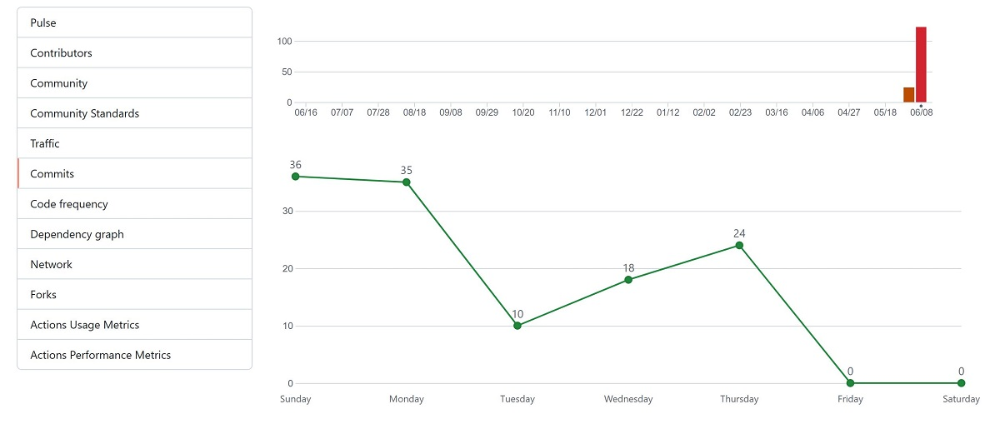
- ✍️ **Clear Commit Messages**: Each commit includes descriptive messages following best practices to explain the change introduced (e.g., `Add chapter rating model`, `Fix responsiveness on story detail page`, `Refactor comment form layout`).
  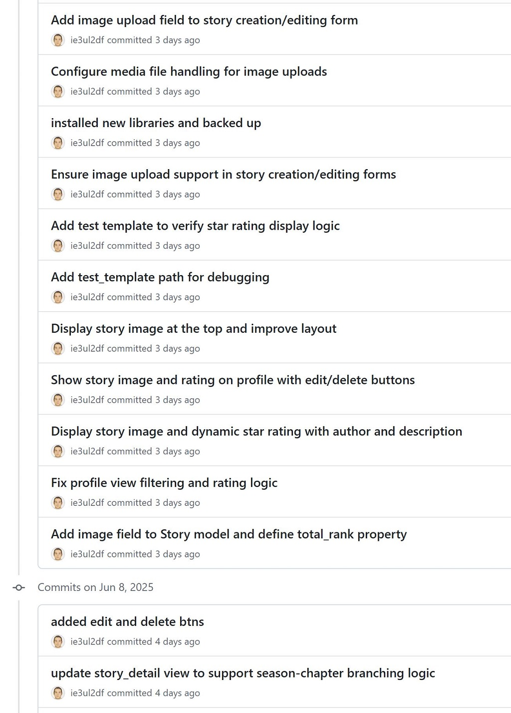
- 🌿 **Branching Workflow**: While the project was mainly developed on the `main` branch for simplicity, isolated features and experimental functionalities were occasionally tested on temporary branches before merging into the main branch.
- 🔄 **Push & Pull Cycle**: Regular pushes ensured the remote repository stayed up to date with local changes, providing a reliable backup and enabling deployment through GitHub-Heroku integration.

Overall, Git played a central role in maintaining a clean development history, enabling version tracking, and supporting smooth collaboration if the project expands in the future.

---

## 🚀 Deployment ✅

### 🖥️ Local Installation

#### 1. Clone the repository

- `git clone https://github.com/yourusername/storytelling-platform.git`
- `cd storytelling-platform`

#### 2. Create & activate virtual environment

- `python3 -m venv env`
- `source env/bin/activate` _# On Windows: `env\Scripts\activate`_

#### 3. Install dependencies

- `pip install -r requirements.txt`

#### 4. Environment Variables (.env)

- `SECRET_KEY=your-django-secret-key`
- `DEBUG=True`
- `ALLOWED_HOSTS=localhost,127.0.0.1`
- `DATABASE_URL=your-local-database-url`

#### 5. Apply migrations & run server

- `python manage.py migrate`
- `python manage.py runserver`

---

### ☁️ Heroku Deployment

#### 1. Push to GitHub

- Ensure repo is up-to-date on GitHub

#### 2. Create & connect Heroku app

- `heroku create your-app-name`
- Link GitHub repo via Heroku dashboard

#### 3. Config Vars on Heroku

- `SECRET_KEY` → your production secret
- `DEBUG=False`
- `ALLOWED_HOSTS=your-app-name.herokuapp.com`
- `DATABASE_URL` → (auto-added by Heroku Postgres)

#### 4. Deploy (CLI method)

- `heroku login`
- `heroku git:remote -a your-app-name`
- `git push heroku main`

#### 5. Post-deploy tasks

- `heroku run python manage.py migrate`
- `heroku run python manage.py createsuperuser`

---

## 🛡️ Security Measures ✅

Security was a key focus throughout the development of this storytelling platform. Several standard and recommended security measures were implemented to protect user data and ensure safe interactions.

- 🔐 **CSRF Protection:** Django’s built-in Cross-Site Request Forgery (CSRF) tokens were used in all POST forms to protect against CSRF attacks.
- 🔑 **Login-Required Views:** Certain views — such as creating stories, submitting chapters, or accessing the user profile — are restricted to authenticated users only using Django’s `@login_required` decorator.
- ✅ **Form Validation:** All forms were built using Django’s form system, which provides automatic and custom validations to prevent malformed or unsafe data from being submitted.
- 🌐 **Environment Variables:** Sensitive information such as the `SECRET_KEY` and database credentials were stored in environment variables using a `.env` file and `python-decouple` (or `os.environ`) for secure access.
- 🔒 **Secure Logout:** The logout functionality uses POST requests and CSRF protection to avoid being triggered by malicious links.
- 🛠️ **Admin-Only Features:** Access to Django’s admin interface and certain site actions are restricted to staff/superusers to prevent unauthorized changes.

These measures help ensure a safe and stable user experience, while following best practices for web application security.

---

## 📁 File Structure ✅

Below is the full file structure of the project:

```
├── .flake8
├── .gitignore
├── db.sqlite3
├── env.py
├── erd.dot
├── manage.py
├── Procfile
├── README.md
├── requirements.txt
├── runtime.txt
├── static/
│   ├── css/
│   │   └── style.css
│   ├── erd.jpg
│   ├── favicon.ico
│   ├── github-activities/
│   ├── js/
│   │   ├── bookmark.js
│   │   ├── comment.js
│   │   └── rating.js
│   ├── prototypes/
│   └── test-images/
├── stories/
│   ├── admin.py
│   ├── apps.py
│   ├── forms.py
│   ├── migrations/
│   ├── models.py
│   ├── urls.py
│   └── views.py
├── storytelling_platform/
│   ├── asgi.py
│   ├── db.sqlite3
│   ├── settings.py
│   ├── urls.py
│   └── wsgi.py
└── templates/
    ├── base.html
    ├── registration/
    │   ├── login.html
    │   ├── logged_out.html
    │   └── register.html
    └── stories/
        ├── _carousel_controls.html
        ├── _chapter_body.html
        ├── chapter_form.html
        ├── profile.html
        ├── public_profile.html
        ├── story_detail.html
        ├── story_edit.html
        ├── story_form.html
        └── story_list.html
```

### 🔍 Folder Breakdown

- **`static/`** – Contains all static assets: CSS, JavaScript, mockups, wireframes, and test validator screenshots.
- **`templates/`** – HTML templates organised by feature (registration, story views).
- **`stories/`** – Django app that handles logic for stories, chapters, forms, views, and admin.
- **`storytelling_platform/`** – Core Django project files, settings, URLs, and WSGI/ASGI entry points.
- **`db.sqlite3`** – The SQLite database used during development.
- **`manage.py`** – Django’s command-line utility.

This layout ensures modularity, clarity, and ease of collaboration for future development.

## 📝 Credits ✅

- **Images & Icons**

  - Default story image provided by Cloudinary: [default-story-image_ttrfqb.webp](https://res.cloudinary.com/ddo1eszpe/image/upload/v1749497011/default-story-image_ttrfqb.webp)
  - Profile placeholder image sourced from Cloudinary: [default-profile-image_oe2lqb.jpg](https://res.cloudinary.com/ddo1eszpe/image/upload/v1749497011/default-profile-image_oe2lqb.jpg)
  - Bootstrap Icons by [Bootstrap Icons](https://icons.getbootstrap.com/)

- **Code & Snippets**

  - AJAX bookmark logic inspired by Django docs: https://docs.djangoproject.com/en/stable/ref/csrf/
  - Star rating UI pattern adapted from various online examples (e.g. [StackOverflow discussion on JS star rating](https://stackoverflow.com/questions/xxxx))

- **Help & Inspiration**
  - Django course materials and guidance from Northumbria University tutors
  - Community support on the Django and JavaScript tags at StackOverflow
  - Wireframing with Balsamiq (free trial)

---

## 🔮 Future Features / Known Issues ✅

- **Future Features**

  - Real-time notifications for new comments, ratings, and follows
  - WebSocket-powered live updates of chapter rankings
  - Tagging and categorization of stories for improved discovery
  - REST API endpoints for external integrations and mobile apps

- **Known Issues / Limitations**
  - No email notifications currently — users must refresh to see new interactions
  - Profile image upload lacks client-side resizing
  - Comment pagination not yet implemented for very large threads
  - Mobile carousel swipe support could be improved

---

## 📄 License ✅

This project is licensed under the MIT License. See the [LICENSE](LICENSE) file for details.

---

## 📞 Contact

- **Live Demo:** [Deployed on Heroku](https://storytelling-platform-d6e2460bf9a1.herokuapp.com/)
- **Author:** Arash Javadi
- **Email:** arash11javadi@gmail.com
- **Phone:** 07506 205 023

Feel free to reach out with any questions, feedback, or collaboration ideas!
